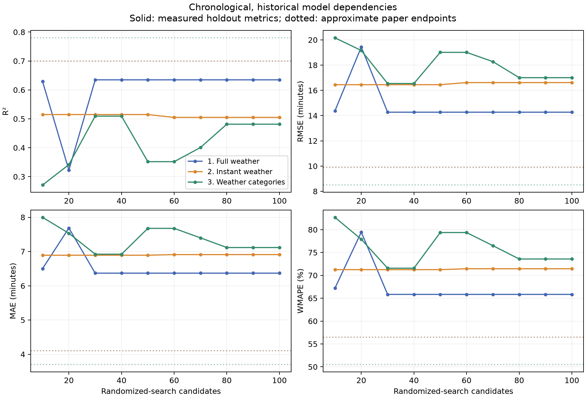
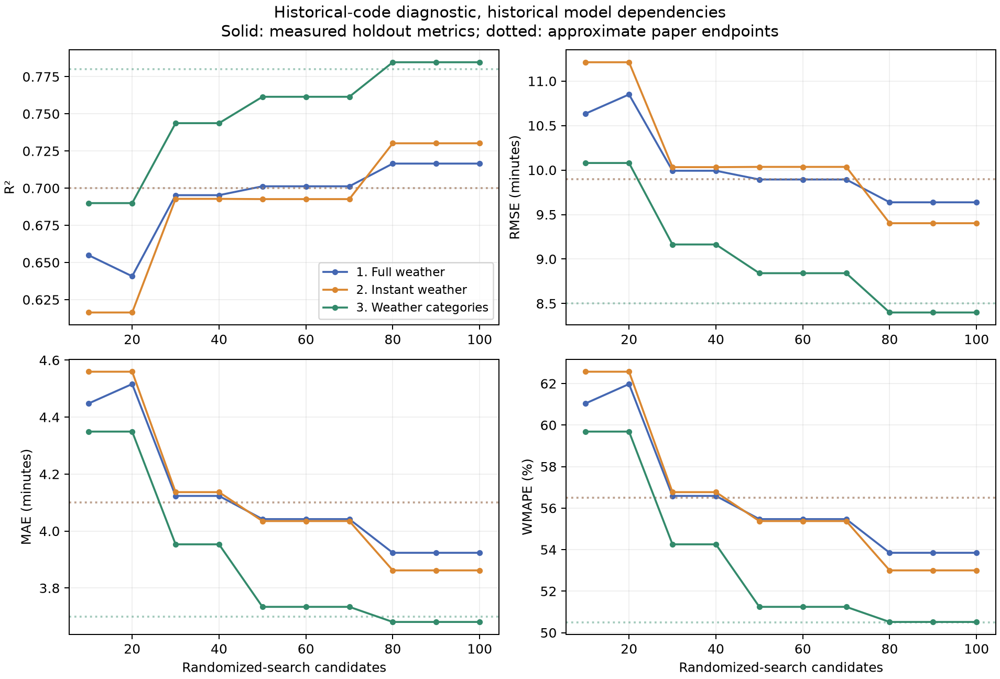

# FI-TW replication results

The reported results were not reproduced under the paper's stated chronological evaluation. The paper's category-only advantage also does not hold in the primary chronological run.

The recovered public-code procedure gives much closer results: RMSE 9.64, 9.40, 8.40 minutes for full weather, instant weather, and weather categories. It uses random splitting, shuffled cross-validation, and different tuning choices. Exact numerical reproduction and paper-run identity remain unverified.

The reconstructed Oulu cohort contains **101,146 events**, matching the reported sample size. Count agreement is not proof of identical row membership or data version. The exact paper-run commit, selected columns, environment, and fitted models are unavailable. A historical dependency export was recovered.

The main interpretation uses `chronological-author`. The author profiles use historical XGBoost 3.0.1, NumPy 2.0.1, pandas 2.2.3, and scikit-learn 1.6.1. Historical SciPy 1.15.1 could not load on this macOS; compatible SciPy 1.17.1 is used instead. Both inclusive and legacy 100-candidate sequences match across the installed modern and author environments; the original SciPy environment could not be run. The complete operating system and Python patch environment are not reproduced.

## Chronological, historical model dependencies

| Scenario | Features | Measured R² | Paper R² | Measured RMSE | Paper RMSE | Measured MAE | Paper MAE | Measured WMAPE | Paper WMAPE |
|---|---:|---:|---:|---:|---:|---:|---:|---:|---:|
| 1. Full weather | 26 | 0.635 | ~0.70 | 14.269 | ~9.9 | 6.368 | ~4.1 | 65.84% | ~56.5% |
| 2. Instant weather | 16 | 0.505 | ~0.70 | 16.615 | ~9.9 | 6.911 | ~4.1 | 71.44% | ~56.5% |
| 3. Weather categories | 18 | 0.481 | ~0.78 | 17.005 | ~8.5 | 7.117 | ~3.7 | 73.58% | ~50.5% |

Final models use the best cross-validation score among all 100 candidates. Prefix curves are descriptive evaluations after selection; no test metric chooses hyperparameters or search budget.

## Historical-code diagnostic, historical model dependencies

| Scenario | Features | Measured R² | Paper R² | Measured RMSE | Paper RMSE | Measured MAE | Paper MAE | Measured WMAPE | Paper WMAPE |
|---|---:|---:|---:|---:|---:|---:|---:|---:|---:|
| 1. Full weather | 28 | 0.717 | ~0.70 | 9.637 | ~9.9 | 3.924 | ~4.1 | 53.85% | ~56.5% |
| 2. Instant weather | 18 | 0.730 | ~0.70 | 9.403 | ~9.9 | 3.862 | ~4.1 | 53.00% | ~56.5% |
| 3. Weather categories | 19 | 0.785 | ~0.78 | 8.399 | ~8.5 | 3.681 | ~3.7 | 50.52% | ~50.5% |

Final models use the best cross-validation score among all 100 candidates. Prefix curves are descriptive evaluations after selection; no test metric chooses hyperparameters or search budget.

This diagnostic uses a random 80/20 split, shuffled KFold, MAE selection, legacy weather thresholds, per-month median fills, and reconstructed train-grouped row order. It does not establish the paper's claimed chronological performance. Original filesystem order and interactive feature selections are unrecorded. We report WMAPE rather than the historical code's unstable per-row MAPE, and we do not adopt its test-RMSE search-budget selection.

This profile follows the historical author's raw-weather-only scaling. Operational and category columns retain their original values and order. Earlier archived diagnostics scaled all columns and omitted scale_pos_weight; comparing them with this corrected run combines parameter, scaling, and software changes.

## Primary evaluation and preprocessing

The first 80,916 chronologically sorted observations form development data. The final 20,230 form test data, from 2023-09-09 12:55:36+00:00 through 2025-01-01 06:29:38+00:00. The development period ends at 2023-09-09 12:46:00+00:00. Five expanding-window validation folds each follow their training fold strictly in time. Every RobustScaler fits only its training fold. XGBoost handles the remaining weather NaNs directly.

The primary feature interpretation follows the eight explicit operational feature IDs in Table IV and the text's cloud omission. This gives 26/16/18 features. The optional count-consistent chronological profile adds day of month and includes cloud, giving the printed 28/18/19; it is not part of the corrected default six-run study. The historical diagnostic uses those printed counts. Gust speed, dew-point temperature, and precipitation amount can contribute to weather categories even though they are not raw model inputs.

Each scenario samples the same 100 configurations with seed 42. The primary search uses inclusive tree counts 100–400 and depths 4–8, learning rates .01/.05/.1, row sampling .7/.8/.9, and feature sampling .7/.8/1.0. The sampled scale_pos_weight values 3.9/4.9/5.9 are passed literally. XGBoost applies these weights to squared-error regression rows whose target equals exactly one minute; this affects 26,908 cohort rows (26.6%) and is not a principled balance of delay classes. Historical integer ranges follow the code's exclusive upper endpoints. The selected model minimizes mean validation RMSE for chronological runs and mean validation MAE for the historical diagnostic. XGBoost uses the CPU histogram tree method. Full details and package versions are recorded in each config.json.

## Cohort and category reconstruction

84 departure-month files cover 2018–2024; 2025 departure files and rolling weather aggregates are excluded. Select station OL and category Long-distance. Of 102,217 source rows, 1,069 have no actual time. Remove those and the two duplicates under the declared retained-feature projection, leaving 101,146. Cancellations with recorded times/targets and negative delays are retained. Overnight events from late December can occur on 1 January 2025. Native data are never modified. All input hashes and the duplicate records are in data/manifest.json.

train_id copies trainNumber. Temporal features follow the pinned historical author convention: actualTime in UTC, fractional hour using minutes, month values 1–12, and weekday Sunday=1 through Saturday=7. These are measurements at the observed station. Actual-time features encode realized delay, so these results cannot establish prediction before departure.

Table II's thresholds apply in printed severity order before any imputation. Missing comparisons fail; Normal/Clear is the residual label, including some incomplete weather. Freezing Rain consumes all Black Ice conditions under the printed hierarchy, so Black Ice is always zero. This is preserved rather than silently fixed. The current author code changes that rule; it is available as an explicit feature-preparation option.

## Metrics and paired scenario comparison

R², RMSE, and MAE use the signed delay target. WMAPE is 100 × sum(abs(y − prediction)) / sum(abs(y)); a signed-denominator alternative is also saved because the paper gives no equation. All paper endpoints are approximate text readings, not exact measurements digitized from Figure 3. The historical code computes a different per-row MAPE, so its percent curve is not an interchangeable reference.

Paired differences use the same primary test rows, with 2,000 daily block bootstrap resamples. Positive differences mean category-only has larger error. Intervals describe this holdout and do not include retraining uncertainty or all long-range temporal dependence.

| Comparison | Metric | Difference, min | Daily bootstrap 95% interval |
|---|---|---:|---:|
| categories minus full | MAE | 0.749 | [0.592, 0.915] |
| categories minus full | RMSE | 2.736 | [1.837, 3.678] |
| categories minus instant | MAE | 0.206 | [0.121, 0.289] |
| categories minus instant | RMSE | 0.390 | [0.074, 0.742] |

Training-mean, training-median, and zero-delay baseline metrics are saved in every result.json. No railway-only model is reported by the paper; these experiments cannot isolate an incremental benefit from weather.

## Reproduction limits

The chronological test target has mean 8.425 minutes and standard deviation 23.611 minutes, compared with development mean 4.387. The test period includes 2024, a year with larger observed delays. This is evidence of a distribution change, not a complete explanation of the numerical gap.

The source-derived train-grouped random split has test standard deviation 18.10135 minutes. The reported R² of 0.78 would imply RMSE 8.490 minutes on that distribution, consistent with the paper's rounded 8.5. The same reported R² would imply RMSE 11.075 minutes on this chronological holdout. This supports the historical evaluation as a plausible origin of the scores, without proving exact experiment identity.

The written paper and public source disagree on feature counts, cloud inclusion, split/CV, selection metric, candidate-count interpretation, weather thresholds, and percentage-error metric. The preserved historical commit is an evidence source, not a verified exact paper run. The native archive's network total differs from the paper's approximately 38.5 million records even though the reconstructed Oulu count agrees. The corrected default study uses XGBoost 3.0.1 with the stated SciPy portability exception. Modern-package and alternative feature-count profiles are available as optional runs; their initial parameter-omitted results are archived and excluded. Exact paper-run identity is still unverified. Numerical non-reproduction cannot be attributed to a single discrepancy from these runs.

Diagnostic test curves evaluate multiple search prefixes, after freezing the selection procedure. This departs from the literal 'test used only once' statement, but no test feedback selects or revises any primary model. Sensitivity protocols were declared from source contradictions, not chosen to match reported scores.

Initial experiments mistakenly omitted scale_pos_weight. They were superseded by corrected runs, excluded from these tables and conclusions, and preserved under results/parameter_omission_diagnostics with a warning. Twelve initial scenarios completed and three were interrupted. The correction restores the literal paper/source parameter rather than adjusting it to match the scores.

## Artifacts and rerun

Run `.venv/bin/python run_replication.py` to recreate the complete study. See [README.md](../README.md) for setup and individual commands. Each profile/scenario saves all 100 candidate fold scores, exact split membership, selected parameters, model, scaler, test predictions, feature importances, and curves. [summary.csv](summary.csv) contains the combined results. [paired_comparisons.json](paired_comparisons.json) contains comparison intervals. Figures are exported as PNG and SVG.

Sources: [supplied paper](https://arxiv.org/abs/2609.11277), [author dataset](https://www.kaggle.com/datasets/viniborin/finland-integrated-train-weather-dataset-fi-tw), [pinned historical source](https://github.com/borinvini/Railway-FMI-Data_training/tree/c28b188948fe42ccc0da2c0f84a81405cc1e2a72). Local evidence is in [protocol_audit.md](../references/protocol_audit.md), [source_search.md](../references/source_search.md), and [data_audit.md](../references/data_audit.md).
